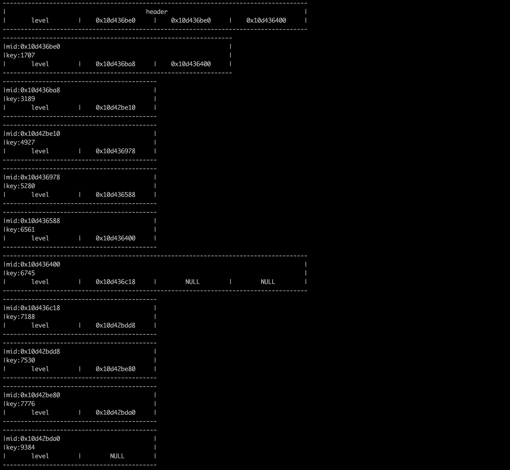

#### 实现原理

基于论文[Skip Lists: A Probabilistic Alternative to Balanced Trees](https://epaperpress.com/sortsearch/download/skiplist.pdf)实现的一个跳表原型

---

#### 依赖

Python >= 3.7

---

#### 使用方式

```python
In [1]: from skiplist import SkipList

In [2]: sl = SkipList()

In [3]: sl[26] = 'SkyMemory'

In [4]: 26 in sl
Out[4]: True

In [5]: list(sl.keys())
Out[5]: [26]

In [6]: list(sl.items())
Out[6]: [(26, 'SkyMemory')]

In [7]: len(sl)
Out[7]: 1

In [8]: for i in range(20):
   ...:     sl[i] = f"data_{i}"
   ...:

In [9]: list(sl.rangekey(5, 10))
Out[9]:
[(5, 'data_5'),
 (6, 'data_6'),
 (7, 'data_7'),
 (8, 'data_8'),
 (9, 'data_9'),
 (10, 'data_10')]

In [10]:
```


---

#### 实现细节

`SkipList`实现了常规增、删、改、查、基于`key`范围查询，基于`rank`的范围查询暂时还没实现。

`SkipList`继承自`collections.abc.Mapping`，实现了`collections.abc.Mapping`抽象类的抽象接口，使得`SkipList`使用上与基本数据类型——字典类似。

另外，`SkipList`提供了一个类似`DEBUG`接口，可用于查看当前跳表内存布局，终端可视化如下所示:

